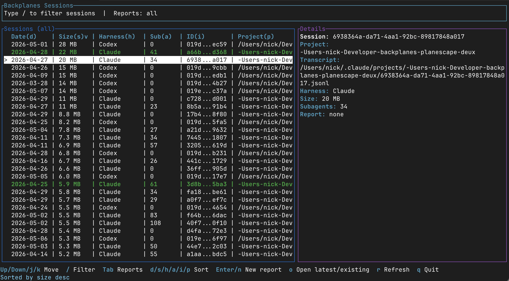

<p align="center">
  
</p>

<h1 align="center">Backplanes CLI</h1>

Turn long Claude Code and Codex sessions into clear, local HTML reports.

Backplanes CLI reads your agent transcript, asks an analyzer to summarize what
happened, and renders a report you can inspect, share, or use during review. It
is designed for engineers who want a fast answer to:

- What did this agent session do?
- Were there security-relevant findings?
- Which files, tools, and workflows mattered?
- What should I review before trusting the result?

## Table of Contents

- [Recent Changes](#recent-changes)
- [Install](#install)
- [Quick Start](#quick-start)
- [What You Get](#what-you-get)
- [Common Workflows](#common-workflows)
- [Command Reference](#command-reference)
- [Tips](#tips)

## Recent Changes

### v0.6.1

- **Alternate Claude config directories:** pass `--claude-config-dir <DIR>` to
  read Claude Code transcripts from a different config root for that run, such
  as `~/.claude-work` or `~/.claude-personal`.

### v0.6.0

- **Bring your own key:** Backplanes can now store local analyzer
  configurations for OpenAI and Anthropic API keys, plus local model endpoints.
- **Local model support:** configure a local provider URL and choose the local
  models you want available for report generation.
- **Model choice across harnesses:** pick any configured model to analyze any
  Claude Code or Codex session, so a Claude session can be reviewed by an
  OpenAI/local model and a Codex session can be reviewed by Anthropic/local.
- **Anthropic subscription change:** removed the old `claude -p` analysis path
  because Anthropic's Terms of Service no longer allow subscription auth for
  this kind of headless automation. Anthropic analysis now requires an API key.

### v0.5.2

- **Observed session posture:** reports now summarize the agents, skills, MCP
  servers, external domains, and outside-project file access observed during the
  session.
- **Richer egress reporting:** Web fetch/search activity now contributes
  contacted domains to the Data Egress section when URLs are present in the
  transcript.

### v0.5.1

- **Windows x86 + ARM64 binaries:** there are now binaries for Windows

### v0.5.0

- **Report feedback widget:** generated reports now include an in-report
  feedback widget so you can send feedback from the report you are reviewing.
- **Clearer legal and telemetry terms:** install and CLI surfaces now state the
  EULA, Terms, Privacy Policy, local-first data posture, and opt-in telemetry
  controls more explicitly.

### v0.4.1

- **Report-first workflow:** `backplanes reports create --latest` creates a
  report for the newest matching session, while `backplanes reports list` opens
  an interactive report browser for the reports you have already generated.
- **Parallel report creation TUI:** `backplanes reports create` can generate
  reports for many sessions at once, shows each row as it moves from pending to
  creating to complete, and keeps the review screen open when the batch
  finishes.
- **Update notices:** interactive CLI invocations periodically check for a newer
  release and print a non-blocking hint to run `backplanes update` when one is
  available.

### v0.4.0

- **Codex support:** Backplanes discovers Codex sessions, reads Codex
  transcripts, estimates Codex/OpenAI usage, and generates reports with either
  Claude or Codex as the analyzer.
- **Interactive session browser:** `backplanes sessions list` opens a Ratatui
  TUI for browsing Claude and Codex sessions together, filtering by report
  status, sorting columns, creating reports in the background, and opening
  existing reports.



## Install

Install the latest release:

```sh
curl -fsSL https://backplanes.com/spotlight/install.sh | sh
```

Verify the install:

```sh
backplanes --version
backplanes --help
```

First-time setup:

```sh
backplanes config
```

Use `backplanes config` to add at least one analyzer provider and choose the
model Backplanes should use for reports. Reports require a configured model
before `backplanes reports create` can run. The config TUI supports OpenAI and
Anthropic API keys, local model endpoints, and configured Codex subscription
entries.

Update later:

```sh
backplanes update
```

Check for an update without installing it:

```sh
backplanes update --check
```

## Quick Start

From a project where you have Claude Code or Codex sessions:

```sh
backplanes config
backplanes reports create --latest
```

Run `backplanes config` once after install to choose the analyzer model for
report generation. After that, normal report commands use the configured
default unless you pass `--model`.

Open the newest existing report later:

```sh
backplanes reports list --latest
```

Generate reports for every discovered Claude session:

```sh
backplanes reports create
```

Limit report creation to the current project:

```sh
backplanes reports create --project
```

## What You Get

Each report is a local HTML file with:

- A top-level verdict for the session.
- Security findings, when the session contains meaningful concerns.
- Informational findings that are not treated as errors.
- Evidence and commands tied back to transcript activity.
- Engineering analytics for review, delivery, and operational context.
- A one-line title so prior reports are easy to browse later.

Backplanes is intentionally local-first: reports are written on your machine and
can be opened in your browser.

The session browser TUI is for human review. It color-codes rows by report
state, shows the harness (`Claude` or `Codex`), keeps session size aligned,
abbreviates long session ids as `first4...last4`, and keeps the full transcript
details visible in the side panel.

## Common Workflows

### Report the current or latest session

```sh
backplanes reports create --latest
backplanes reports create --latest --project
```

Use this when you want the fastest path from a recent agent session to a local
HTML report.

### Browse sessions before reporting

```sh
backplanes sessions list
```

`sessions list` opens the interactive browser. Use `j`/`k` or the arrow keys to
move, `/` to filter, `Tab` to cycle report status filters, and
`d`/`s`/`h`/`i`/`p` to sort by date, size, harness, id, and project. Press
`Enter` or `n` to create a report in the background, `o` to open a report, `r`
to refresh, and `q` to quit.

For scoped browsing, pass discovery filters to `sessions list`:

```sh
backplanes sessions list
backplanes sessions list --project-only --days 7
backplanes sessions list --claude-config-dir ~/.claude-work
```

### Use a separate Claude config root

If you keep separate Claude Code homes, point Backplanes at the one you want to
inspect for that run:

```sh
backplanes sessions list --claude-config-dir ~/.claude-work
backplanes reports create --latest --claude-config-dir ~/.claude-personal
```

Backplanes reads Claude transcripts from `<dir>/projects`, leaving your default
`~/.claude` untouched.

### Create reports from a set of sessions

```sh
backplanes reports create --days 7
backplanes reports create --days 7 --project
backplanes reports create --all --harness all
```

When the selection is larger than five sessions, Backplanes asks for
confirmation before spending analyzer tokens. Use `--dry-run` first if you want
to see the scope without running analyzers:

```sh
backplanes reports create --days 7 --project --dry-run
```

### Open an existing report

```sh
backplanes reports list
backplanes reports list --latest
backplanes reports list --project
```

`reports list` opens an interactive report browser in a terminal. Use the arrow
keys or `j`/`k` to move through reports and press `o` to open the selected HTML
report.

### Use a specific analyzer or model

```sh
backplanes reports create --latest --harness codex --analyzer codex
backplanes reports create --latest --analyzer claude --model claude-opus-4-1
backplanes reports create --latest --analyzer codex --model gpt-5.5
```

## Command Reference

### `backplanes reports`

Create and browse reports.

```sh
backplanes reports create --latest
backplanes reports create --days 2 --project
backplanes reports create --all --harness all
backplanes reports list
backplanes reports list --latest
```

Useful options:

| Option | Description |
| --- | --- |
| `--latest` | Select the newest matching session. |
| `--days <n>` | Select sessions modified in the last `n` days. |
| `--all` | Select all matching sessions. This is the default for `reports create` and `reports list`. |
| `--project` | Limit discovery to the current project. |
| `--harness <all|claude|codex>` | Choose which harness transcripts to discover. |
| `--jobs <n>` | Maximum reports to create concurrently. |
| `--dry-run` | Show what would run without invoking the analyzer. |
| `--analyzer <auto|claude|codex>` | Choose the analyzer CLI. |
| `--model <name>` | Pass a model to the analyzer invocation. |
| `--claude-config-dir <dir>` | Read Claude Code transcripts from `<dir>/projects` for this run. |

### `backplanes sessions`

Find sessions you can report on.

```sh
backplanes sessions list
backplanes sessions list --project-only --days 7
backplanes sessions list --project /path/to/project --days 30
```

Useful options:

| Option | Description |
| --- | --- |
| `--project-only` | Limit results to the current project. |
| `--project <dir>` | Limit results to an explicit project directory. |
| `--days <n>` | Only include sessions modified in the last `n` days. |
| `--claude-config-dir <dir>` | Read Claude Code transcripts from `<dir>/projects` for this run. |

### `backplanes update`

Keep the CLI current.

```sh
backplanes update
backplanes update --check
```

Backplanes also checks periodically during interactive CLI usage and prints a
short notice when a newer release is available. The notice is informational; run
`backplanes update` when you are ready.

## Tips

- Start with `backplanes reports create --latest --dry-run` if you are unsure
  which transcript will be analyzed.
- Use `backplanes sessions list --project-only --days 7` to narrow a busy
  session history.
- Run `backplanes sessions list` when you want to inspect Claude and Codex
  sessions visually before creating or opening a report.
- Use `backplanes reports list` to reopen previous reports by title.
- Pass `--model` when you want to pin a specific analyzer model for consistency.
- Run `backplanes <command> --help` for the complete options for any command.
